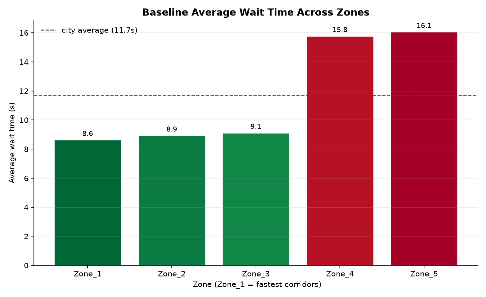
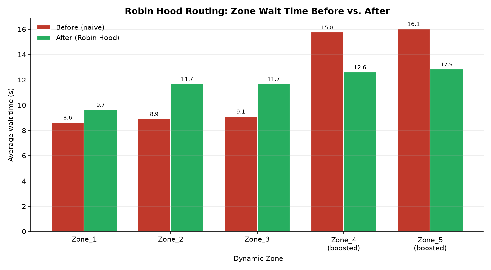

# Robin Hood Routing — Urban Traffic Fairness

Naive traffic optimization keeps prioritizing zones that are already well
served. This project detects that "Reverse Robin Hood" bias and reallocates
priority toward the worst-off zones instead — using ML-discovered zones and a
per-zone "Digital Twin" to predict who needs help next.

## Requirements

Python 3.9+, plus:

```bash
pip install pandas numpy matplotlib scikit-learn
```

## Run it

Put `robin_hood_routing.py` and `smart_city_traffic_mobility.csv` in the same
folder, then:

```bash
python robin_hood_routing.py
```

No arguments needed — all settings are constants at the top of the script.

The CSV must have these columns (the script validates and names any that are
missing):

`intersection_id, city_zone, average_wait_time, congestion_score,
vehicle_count, average_speed, timestamp, hour`

## Pipeline

Each step is its own function, so you can run, skip, or swap pieces
independently.

| # | Function | What it does |
|---|---|---|
| 0 | `load_data` | Reads and validates the CSV |
| 1 | `discover_dynamic_zones` | K-Means clusters intersections by actual behavior (wait time, congestion, volume, speed) — ignoring the dataset's fixed `city_zone` |
| 2 | `build_state_mirror` | Congestion per zone at every timestamp, binned into Low / Medium / High / Critical |
| 3 | `build_transition_matrices` | Markov transition matrix per zone, `P(next hour \| this hour)` (skipped if `SIMPLE_MODE`) |
| 4 | `compute_risk_scores` | `rho` per zone + the risk equity gap |
| 5 | `baseline_chart` | Saves `baseline_wait_time.png` — the "naive optimizer" starting point |
| 6 | `robin_hood_fix` | Cuts wait time by `BOOST_PCT` for zones that qualify for help |
| 7 | `before_after_chart` | Saves `before_after_wait_time.png` |
| 8 | `equity_score_table` | 0–100 equity scores and letter grades → `equity_summary.csv` |
| 9 | `plain_english_summary` | Console narrative using the real computed numbers |

## Output

Three files, written to the working directory:

| File | Contents |
|---|---|
| `baseline_wait_time.png` | Wait time per zone before any fix, red (worst) → green (best) |
| `before_after_wait_time.png` | Wait time per zone, before vs. after Robin Hood Routing |
| `equity_summary.csv` | `dynamic_zone, avg_wait_before, avg_wait_after, rho, equity_score_before, equity_score_after, grade_before, grade_after` |

Plus a console log: zones discovered, how often each sits in each congestion
state, the risk equity gap, which zones qualified for help and why, the full
equity table, and the closing summary.

## Config

```python
DATA_FILE        = "smart_city_traffic_mobility.csv"
N_CLUSTERS       = 5      # ML-discovered behavioral zones
BOOST_PCT        = 0.20   # wait-time cut for zones that qualify for help
RANDOM_STATE     = 42     # KMeans seed, for reproducible zone assignments
PROJECTION_HOURS = 3      # how far ahead the Digital Twin projects
SIMPLE_MODE      = False  # True = skip the Markov projection and score risk
                          # from each zone's historical High+Critical rate
```

Charts, CSV, and summary all follow whatever you set here — no other code
changes needed.

## Results on the provided dataset

204,000 rows, 100 intersections, 85 days. The city's 6 official zones are
ignored; K-Means finds 5 behavioral ones.

| Zone | Wait before | Wait after | rho | Grade |
|---|---|---|---|---|
| Zone_1 | 8.64s | 8.64s | 0.477 | A → A |
| Zone_2 | 8.94s | 8.94s | 0.483 | A → A |
| Zone_3 | 9.13s | 9.13s | 0.504 | A → A |
| Zone_4 | 15.78s | 12.62s | 0.518 | F → D |
| Zone_5 | 16.06s | 12.85s | 0.518 | F → D |

**Wait-time equity gap: 7.4s → 4.2s, narrowed 43.3%** — and no zone was made
worse to get there.

The split is stark: three zones wait ~9s, two wait ~16s. That near-2x gap is
the bias the project exists to surface.





## Design notes

Decisions worth knowing about, including two places where the obvious approach
turned out to be wrong.

### Why the twin keeps every timestamp

The intuitive way to build the state mirror is to average congestion per
`(zone, hour-of-day)` — 24 tidy rows per zone. **That silently makes the Markov
projection useless.** A transition matrix estimated from a single wrapped
24-hour cycle has the observed state frequencies as its own stationary
distribution, so projecting it forward — one step, twelve, or a hundred —
provably returns the base rate it was built from. `SIMPLE_MODE` and full mode
become mathematically identical.

So step 2 keeps all 2,040 hourly observations per zone and step 3 estimates
from ~2,039 real consecutive-hour transitions. Only transitions between
genuinely adjacent hours are counted, so a gap in the data never invents a jump
that didn't happen.

### Chronic risk vs. the live outlook

These are different questions and the script reports both:

- **`rho` (chronic risk)** — the twin's projected High+Critical risk averaged
  over every hour the zone actually lives through. This drives the
  intervention, because equity aid has to target who is *systematically* worst
  off.
- **`outlook_3h` (live forecast)** — where the zone is heading in the next
  `PROJECTION_HOURS`, given its state at the most recent timestamp in the data.
  Tactical, not structural.

Scoring fairness off a single moment's projection ranks zones by whichever bin
they happened to occupy at that instant — which, on this dataset, put the
*best-served* zone top of the risk table. That is the exact bias the project is
about, so it drives the intervention off chronic risk instead.

`rho` lands very close to the raw historical rate (0.477 vs. 0.476 for Zone_1).
That is a calibration check, not a redundancy: a well-fitted chain *should*
reproduce long-run frequencies. The forecasting value shows up in `outlook_3h`,
which ranges 0.19–0.25 while base rates sit near 0.50.

### Qualifying for help takes two things

A zone is boosted only if it is **both** above-average risk **and**
above-average wait. Risk alone isn't enough — a zone can run congested while
still being waved through quickly, and on this data exactly that happened
(Zone_3: high risk, 9.1s waits). Handing it the budget would have made an
already well-served zone the fastest in the city — Reverse Robin Hood again,
just wearing the fix's clothes.

### State binning handles a saturated score

`congestion_score` is capped at 100 and sits exactly there ~27% of the time, so
the 75th percentile *is* 100 and plain quantile binning collapses to 3 bins.
Ranking instead would give even bins but scatter the identical value 100 across
two different states.

So binning is equal-frequency at the level of distinct values: equal scores
always share a state, and bins land as close to 25% as the ties allow. Datasets
with fewer distinct values than states fall back to equal-width bins.

### Smaller calls

- **Zone labels are rank-ordered by wait time** (`Zone_1` = best-served), so
  charts read intuitively regardless of K-Means' arbitrary cluster numbering.
- **Clustering runs per intersection**, not per row, so one intersection
  belongs to exactly one zone.
- **Binning is global, not per-zone**, so "High" means the same congestion
  everywhere — that comparability is what makes cross-zone risk meaningful.
- **Equity score = how close a zone's wait is to the best-served zone's**
  (100 = treated as well as the best zone in the city). Both columns use the
  same *before* benchmark, so after-scores are directly comparable instead of
  being re-normalized onto a new scale.
- **Two distinct "equity gaps" exist.** The `rho` risk gap is the same before
  and after — routing doesn't change congestion physics. The wait-time gap is
  the one that actually narrows.

## Limitations

- The `BOOST_PCT` cut is a **modeled** reallocation, not a traffic simulation.
  It shows who *should* get priority and what the equity payoff looks like; it
  doesn't re-simulate signal timing or verify the capacity exists to deliver it.
- Zone assignments depend on `N_CLUSTERS` and `RANDOM_STATE`. The 3-good /
  2-bad split is robust on this data, but the exact zone boundaries aren't.
</content>
</invoke>
